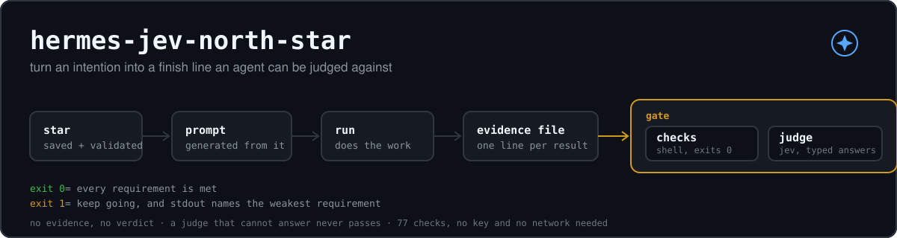
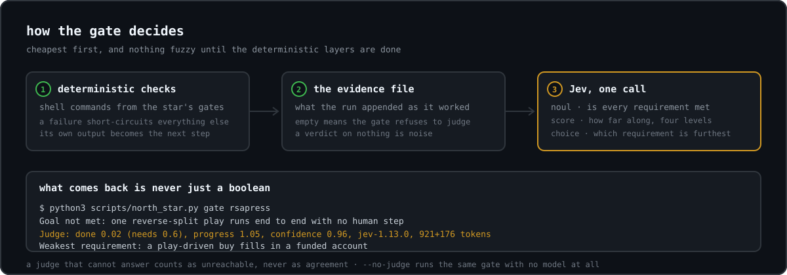

# hermes-jev-north-star



A [Hermes Agent](https://github.com/NousResearch/hermes-agent) skill that turns an intention into
a finish line an agent can be held to, generates the prompt that starts the run, and then lets
[Jev](https://typesafe.ai) decide whether the fuzzy requirements are really met.

Long autonomous runs fail in one of two ways: they stop early and call it done, or they never
stop. Both come from the same missing thing, a written finish line with states someone can point
at. This skill interviews the owner until that exists, refuses the result if it cannot be judged,
and hands back three artifacts: the star, the generated run prompt, and the gate that decides
whether the work is actually finished.

The gate is deliberately two-layered. Machine-checkable parts run as plain shell commands. The
part no script can decide - "the round-up arrived as a whole share", "a stranger completed
checkout without writing to us" - goes to Jev, which answers with a probability and a calibrated
confidence instead of prose, so the gate stays code and never reads a model's opinion of its own
progress.

Everything else runs offline: pure Python, no dependencies, no key needed for the deterministic
half. Jev is wired in as the default judge when a `TYPESAFE_API_KEY` is present, and the gate says
plainly when it is not.

Not an official Nous Research or TypeSafe project.

## Install

```bash
hermes skills install https://raw.githubusercontent.com/poponline63/hermes-jev-north-star/main/SKILL.md
```

A SKILL.md URL is what Hermes installs from. `hermes skills inspect <same url>` previews it first.
That install copies the skill document, `references/`, and `templates/`; it does not copy
`scripts/`, so clone the repo once to have the tool on disk:

```bash
git clone https://github.com/poponline63/hermes-jev-north-star ~/hermes-jev-north-star
python3 ~/hermes-jev-north-star/scripts/north_star.py --help
```

Then in a chat session:

```
/hermes-jev-north-star the public downloads page for my CLI tool is finished
```

Any agent that can run a shell command can use it without Hermes at all: the skill is one markdown
file plus two stdlib Python scripts.

## Quick start

Write a star as JSON:

```json
{
  "goal": "a stranger can install the CLI, run it against their own data, and get a correct report without asking anyone for help",
  "for_whom": "someone who found the repo today and has never spoken to the maintainer",
  "requirements": [
    "the documented install command works on a clean machine",
    "the example in the README runs against the shipped sample data and prints a report"
  ],
  "checks": {
    "the documented install command works on a clean machine": "run the install line from the README in a fresh container and paste the output",
    "the example in the README runs against the shipped sample data and prints a report": "copy-paste the README example verbatim and compare its output to the sample report in docs/"
  },
  "out_of_scope": ["packaging for other operating systems", "a hosted version"],
  "stop_rule": "stop when both are demonstrably true; hand back before changing anything a user's data depends on",
  "first_action": "run the README install line in a container and record exactly what it prints"
}
```

Save it and get the run prompt:

```bash
$ python3 scripts/north_star.py set downloads-page --from-json star.json
north star 'downloads-page' saved: ~/.hermes/north-star/stars/downloads-page.json
2 requirements, 2 with a stated verification.

prompt for the run:
  python3 scripts/north_star.py prompt downloads-page

$ python3 scripts/north_star.py prompt downloads-page
GOAL
a stranger can install the CLI, run it against their own data, and get a correct report without
asking anyone for help. Finished for: someone who found the repo today and has never spoken to
the maintainer.

GROUND TRUTH - do not re-derive any of this
- (fill this in: repo + branch + remote, host + access + ports, where credentials live ...)

WHAT MUST BE TRUE, AND HOW EACH ONE IS SEEN
1. the documented install command works on a clean machine
   Done when: run the install line from the README in a fresh container and paste the output
2. the example in the README runs against the shipped sample data and prints a report
   Done when: copy-paste the README example verbatim and compare its output to the sample report in docs/
...
```

Paste that prompt into a fresh run. The run appends what it actually finds to an evidence file as
it works, and the gate judges that file:

```bash
$ python3 scripts/north_star.py evidence downloads-page --add "ran the README install line in a fresh container: exit 0, 12 packages"
$ python3 scripts/north_star.py gate downloads-page
Goal not met: a stranger can install the CLI, ...
No judge is configured (--judge), so nothing here ranks the requirements. Take the first one that is not proven yet.
Start with: the documented install command works on a clean machine
Done when: run the install line from the README in a fresh container and paste the output
$ echo $?
1
```

Exit 0 means met. Exit 1 means keep going, and stdout is the next step. Exit 2 means the star is
missing or not drivable, so nothing was judged.

## What the tool refuses

The refusals are the point. A star that cannot be driven is worse than no star, because a run
will happily satisfy the wrong sentence.

```bash
$ python3 scripts/north_star.py set app --from-json bad.json
refused: this star cannot drive a run (9 problem(s)):
- goal: 'polished' is a mood, not a state. Say what would be true instead.
- for_whom: missing. Who is this finished for?
- requirement 'better UX...': 'better ux' cannot be pointed at.
- checks: the requirement is stated twice, nothing is verified -> better UX
- checks: no way to see that this is true -> clean up the code
- out_of_scope: empty. The boundary is what stops a run wandering.
- stop_rule: missing. When does the run stop and hand back?
- first_action: missing. What is the first thing it should do?
```

It also refuses unknown fields, over-long requirements, and more than twelve of them. Two softer
cases only produce a note: a check that names no observable action, and a check that is too short
to verify anything.

## The gate



Order of business, cheapest first:

1. **Deterministic gates** (`gates` in the star): shell commands that exit 0 when a
   machine-checkable part of the goal is true. A failure short-circuits everything and its own
   output becomes the next step.
2. **The evidence file** (`~/.hermes/north-star/state/<name>.md`). Empty, and the gate refuses to
   judge at all rather than guessing.
3. **The judge.** Jev by default, or any command you prefer:

```bash
python3 scripts/north_star.py gate downloads-page              # Jev when a key is configured
python3 scripts/north_star.py gate downloads-page --judge jev  # insist on Jev
python3 scripts/north_star.py gate downloads-page --no-judge   # deterministic only
python3 scripts/north_star.py gate downloads-page --judge "python3 my_judge.py"
```

```python
# my_judge.py - reads the star + state as JSON on stdin
import json, sys
data = json.load(sys.stdin)
print(json.dumps({"met": False, "weakest": data["requirements"][0]}))
```

The judge prints `{"met": true|false, "weakest": "<requirement, optional>"}`, or prints nothing
at all and lets its exit code decide (0 = met). A judge that prints text without a readable
verdict is treated as unreachable: a broken answer must never read as agreement, and a gate that
cannot reach its judge never passes silently.

The judge runs through a shell, so quote paths that contain spaces. If it cannot be launched at
all, the gate says so and returns not-met rather than passing.

### Judged by Jev

[Jev](https://typesafe.ai) (TypeSafe's System One) is a decision model: it does not write text, it
answers typed questions with probabilities and a calibrated confidence. That is exactly the shape
a gate needs, because the gate can then threshold a number instead of reading an argument.

One call asks three things about the run's evidence:

| question | primitive | what the gate does with it |
|---|---|---|
| is **every** requirement met? | `noul` | compared against the threshold (0.60 by default) |
| how far along is this, on four levels? | `score` | the probability mass on the top level must clear 0.50 |
| which requirement is furthest from being met? | `choice` | becomes the next step, with its own check line |

The verdict is never a bare boolean:

```bash
$ python3 scripts/north_star.py gate rsapress --state "buy returned insufficient_funds, no order
placed; 21 filled sells logged; cap fix committed locally but the VPS still runs the old exe"
Goal not met: one reverse-split play runs end to end with no human step ...
Judge: done 0.02 (needs 0.6), progress 1.05, confidence 0.96, jev-1.13.0, 921+176 tokens
Weakest requirement: a play-driven buy fills in a funded account
Done when: read the broker's own order state as filled and reconcile it against the account's position list
```

Confidence, model name and token usage are printed, so you can see how a verdict was reached and
what it cost.

What we measured before wiring it in as the default, on one real project:

- It agreed with the obvious read every time: an unbuilt pipeline scored 0.02-0.15 done, and it
  picked the genuinely blocked requirement as the weakest.
- On an **empty** state it was worthless and self-contradictory (0.14 done beside "nothing material
  looks met"), which is why the gate refuses an empty evidence file before any judge is asked.
- Its numbers move between calls on the same state. Treat the threshold as a coarse signal and the
  deterministic checks as the load-bearing part. Nothing here depends on Jev being right: a judge
  that cannot answer never passes, and `--no-judge` gives you the same gate with no model at all.

In Hermes, a failing gate short-circuits the loop's own judge, so the run continues on a concrete
next step rather than on a model's opinion about its own progress:

```
/goal gate add python3 <skill>/scripts/north_star.py gate downloads-page
```

## Layout

```
SKILL.md                      the skill itself
docs/hero.svg                 the banner above, drawn as SVG
docs/gate.svg                 the gate diagram
docs/social-preview.svg       the source for the link-preview card
docs/social-preview.png       that card exported at 1280x640 (the only binary here)
scripts/north_star.py         the CLI: set, check, prompt, evidence, gate
scripts/jev_judge.py          the Jev judge: one System One call, three questions
scripts/smoke_test.py         every claim above, asserted (77 checks, no key needed)
templates/star.example.json   a star that passes, to start from
references/star-format.md     field reference and the refusal rules
```

Run the tests:

```bash
python3 scripts/smoke_test.py
```

## Where stars live

`$NORTH_STAR_HOME`, defaulting to `~/.hermes/north-star`:

```
stars/<name>.json     the stars
state/<name>.md       the evidence each run leaves behind
```

Plain files. Readable, diffable, and yours. No database, nothing to migrate.

## License

MIT. See [LICENSE](LICENSE).
